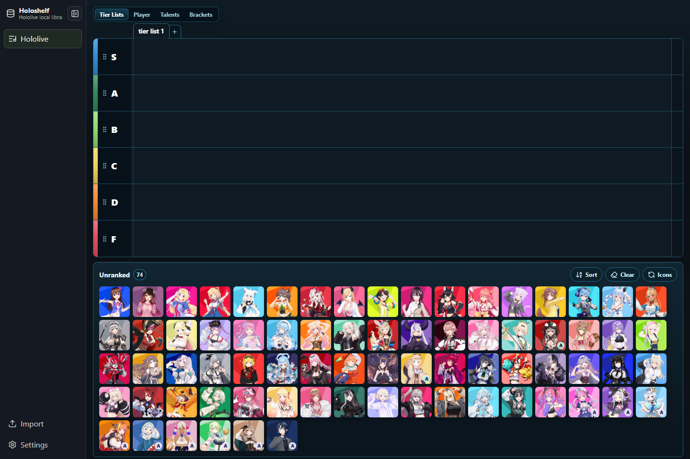
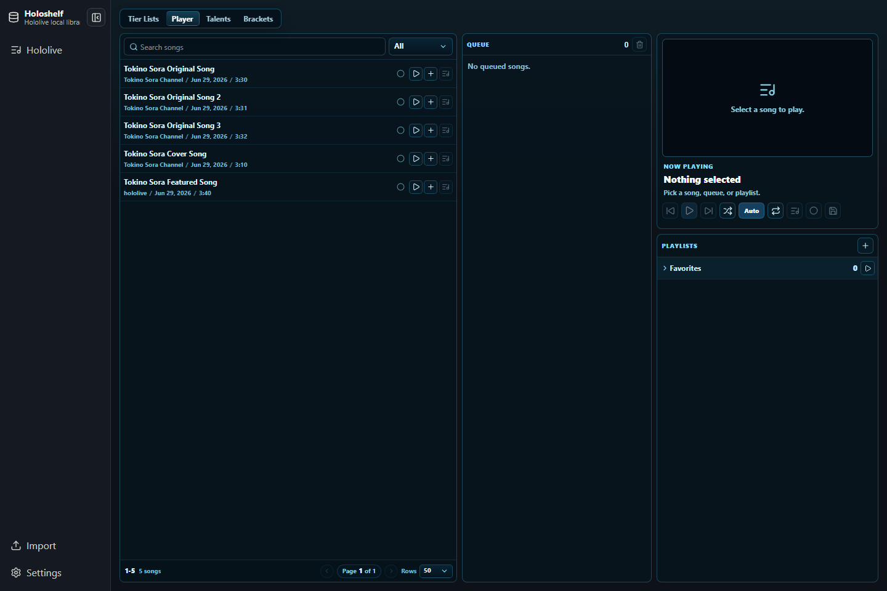

# Holoshelf

Holoshelf is a Windows desktop app for keeping a local Hololive music, talent, tier-list, playlist, and bracket shelf. It is an unofficial fan project and stores your data locally in SQLite.

## Features

- Hololive talent shelf with official talent metadata and cached images.
- Drag-and-drop Hololive idol tier boards with multiple boards and custom tiers.
- Hololive music catalog built from Holodex data, including originals, covers, collabs, and duplicate cleanup metadata.
- YouTube playlist-style player, queue, favorites, markers, and exclusions.
- Custom talent support for personal local additions.
- Song brackets with archive/history views.
- Local-first data storage with optional Holodex and YouTube API keys.
- GitHub Releases auto-update support for packaged Windows builds.

## Screenshots





## Download And Install

1. Open the GitHub Releases page for this repository.
2. Download `Holoshelf-Setup-<version>.exe`.
3. Run the installer on Windows, review the notice/license page, choose an install location, and choose whether to add desktop and Start Menu shortcuts.
4. Leave **Launch Holoshelf** checked on the finish page if you want to open the app immediately.

If Holoshelf is already installed, the setup wizard switches to an update/repair page. It shows the existing install folder, the selected install folder, the installed version, and the installer version. Running the same version repairs the app files. Running a different version installs that version over the existing app files. Changing the selected folder moves the app files to that folder. Shortcut choices preserve the current shortcut state by default, and `%APPDATA%\Holoshelf\data` is preserved.

The v1 builds are unsigned. Windows SmartScreen may show an unknown-publisher warning until the project uses code signing.

## Updates

Packaged builds check GitHub Releases for updates. Use **Update now** in Settings to check for a release. When an update is found, Holoshelf downloads it in the background and shows **Restart to update** when it is ready.

Development builds do not check for updates. Private repository releases are useful for staging, but public auto-update should be treated as production-ready only after the release repository and release artifacts are public. Do not embed a GitHub token in the app.

App updates can include newer bundled official Hololive data. On launch, Holoshelf merges that official data into your local database and preserves your ratings, tier boards, custom talents, playlists, queue, markers, brackets, API keys, and other personal state.

## Data Location

By default, installed builds store user data here:

```text
%APPDATA%\Holoshelf\data
```

The main database is:

```text
%APPDATA%\Holoshelf\data\holoshelf.sqlite
```

Holoshelf copies the bundled sanitized template database and image cache into that folder only on first run, when no `holoshelf.sqlite` exists. Updates never overwrite your existing database or image cache.

Advanced users can set `HOLOSHELF_DATA_DIR` to use a custom data folder.

## Uninstalling

Uninstalling Holoshelf removes the installed app files. It does not delete `%APPDATA%\Holoshelf\data`, so your ratings, tier boards, playlists, brackets, custom talents, API keys, image cache, and local database remain available if you reinstall later.

## Refresh Behavior

The public build ships with a sanitized Hololive template dataset and cached Hololive talent images. Refresh actions can call Holodex, YouTube, and Hololive image sources when you request updated data, stats, or images.

API keys are optional. Holodex and YouTube API keys entered in Settings are stored only in your local SQLite database.

## Credits And Notices

Holoshelf is an unofficial fan project and is not affiliated with COVER Corporation, Hololive Production, Holodex, YouTube, or Google. Holodex API is used for Hololive channel and music metadata. YouTube and the YouTube Data API are used for playback, metadata, and optional statistics refreshes. The bracket feature was inspired by Quizei: https://quizei.com/

## Development

```powershell
npm ci
npm run typecheck
npm test
npm run e2e
npm run build
```

Remove generated build, release, test, log, and local backup artifacts:

```powershell
npm run clean
```

Create and verify release seed data:

```powershell
npm run release:seed
```

Refresh the release source database, regenerate seed data, and prepare a data update:

```powershell
npm run release:data:wizard
```

You can also double-click `Update Release Data.cmd` from the project root. The wizard prompts for Holodex and YouTube API keys, uses them only for that refresh process, regenerates the bundled seed, and can bump/install a local patch update when it finishes.

Build local unsigned Windows release artifacts without publishing:

```powershell
npm run release:local
```

Install a freshly built local release over the current per-user install:

```powershell
npm run release:update:installed
```

You can also double-click `Update Installed App.cmd` from the project root. This is the maintainer-friendly path for normal code updates: it bumps the patch version, builds the production installer, installs it over your current per-user app, and verifies the installed executable version.

The installed app only updates when the new build has a higher SemVer version than the installed build. Rebuilding or rerunning `Holoshelf-Setup-<same version>.exe` is not a release update.

## Release Pipeline

Public updates are versioned GitHub Releases:

1. Run `npm run release:data:refresh` when official Hololive songs, stats, or bundled default data need updating.
2. Bump the app version, for example `npm run release:bump:patch`.
3. Commit the versioned code, `package.json`, `package-lock.json`, and refreshed `resources/seed` changes.
4. Push a matching tag, for example `v1.0.1`.
5. GitHub Actions runs checks, builds `Holoshelf-Setup-<version>.exe`, `latest.yml`, and the blockmap, then publishes the tag release.
6. Installed apps find that release from Settings with **Update now**.

The workflow rejects tag releases when the tag does not match `package.json` or when the updater metadata is not patched to the real GitHub owner/repo.

For a local installed-app update test after refreshing data:

```powershell
npm run release:data:wizard
```

Choose the wizard option to bump the patch version and install a local app update. It refreshes release data, bumps the patch version, builds the installer, runs it over the current per-user install, and verifies the installed executable version.

## Release Data Refresh

`Update Release Data.cmd` and `npm run release:data:wizard` are the maintainer-friendly path. They prompt for API keys and then call `npm run release:data:refresh`, which is the outside-the-app equivalent of the Hololive official songs and stats refresh. It targets local maintainer working data at `data/holoshelf.sqlite`, not your installed AppData database. The ignored `data/` folder is used to regenerate the tracked bundled seed; it is not shipped directly. The refresh then:

- refreshes official Holodex channel and song data with relationships and collabs;
- refreshes YouTube view stats when a YouTube Data API key is available;
- writes audit CSV/JSON artifacts to `data/holodex-refresh/latest`;
- writes source database backups outside the project by default, under `%APPDATA%\Holoshelf\release-data-backups`;
- stamps a new `hololive.officialDataVersion`;
- removes Holodex and YouTube API key settings from the source release database by default;
- regenerates `resources/seed/holoshelf-template.sqlite` and `resources/seed/official-data.json`.

Useful options:

```powershell
$env:HOLODEX_API_KEY="your-holodex-key"
$env:YOUTUBE_API_KEY="your-youtube-data-key"
npm run release:data:refresh -- --skip-stats
npm run release:data:refresh -- --version=2026-06-29T120000Z
npm run release:data:refresh -- --page-limit=5 --video-stats-limit=500
```

Installed users receive refreshed official data through a normal patch release. On launch after the update, Holoshelf compares the bundled `resources/seed/official-data.json` version against each user's local `hololive.officialDataVersion`, then merges official rows into their database without replacing personal ratings, tier boards, playlists, queue, markers, brackets, custom talents, API keys, or layout settings.

## Troubleshooting

- If SmartScreen blocks launch, confirm the file came from the project GitHub Releases page and use the Windows "More info" flow.
- If music stats refresh fails, add a YouTube Data API key in Settings.
- If Holodex refresh is rate-limited, add a Holodex API key in Settings or retry later.
- If data looks missing after an update, check Settings for the active data directory.
- If you need a clean first run, close Holoshelf and move `%APPDATA%\Holoshelf\data` aside before launching again.
